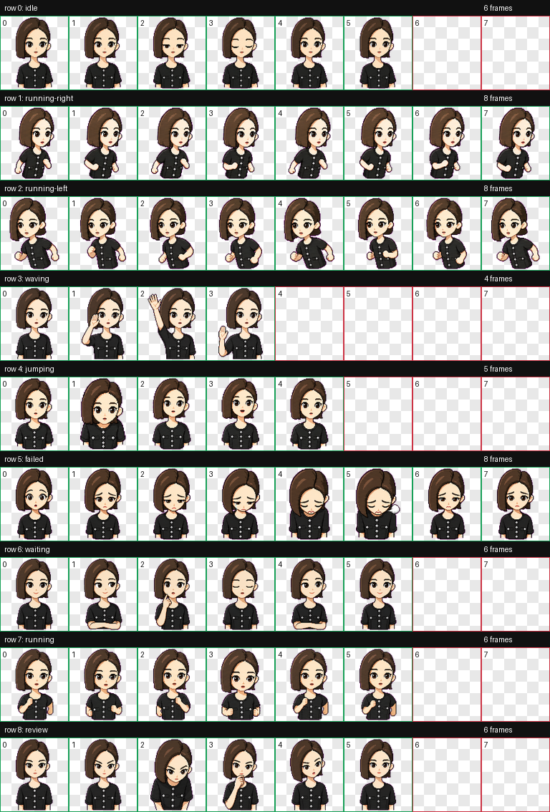

# Doubao Codex Pet

An animated Doubao-style custom pet for the Codex app.



## Install

After this repository is published, macOS/Linux users can install with:

```sh
curl -fsSL https://raw.githubusercontent.com/wangyufeng0615/doubao-codex-pet/main/install.sh | sh
```

Windows PowerShell users can install with:

```powershell
iwr https://raw.githubusercontent.com/wangyufeng0615/doubao-codex-pet/main/install.ps1 -UseB | iex
```

Or clone the repository and run the installer:

```sh
git clone https://github.com/wangyufeng0615/doubao-codex-pet.git
cd doubao-codex-pet
./install.sh
```

The installer copies:

```text
pets/doubao/pet.json
pets/doubao/spritesheet.webp
```

to:

```text
${CODEX_HOME:-$HOME/.codex}/pets/doubao/
```

Then open Codex, go to **Settings > Appearance > Pets**, refresh custom pets, and choose **Doubao**. You can also type `/pet` in Codex to wake or tuck away the pet overlay.

## Install From Codex

Codex does not currently document a native `codex pet install <github-url>` command. A practical Codex-friendly install prompt is:

```text
Install the Codex pet from https://github.com/wangyufeng0615/doubao-codex-pet
```

Codex can clone the repo, run `./install.sh`, and refresh the local pet files.

## Optional Plugin Route

This repo also includes a Codex plugin wrapper so users can add the GitHub repo as a plugin marketplace:

```sh
codex plugin marketplace add wangyufeng0615/doubao-codex-pet
```

After installing the **Doubao Pet** plugin in Codex, ask:

```text
$doubao-pet install Doubao
```

The plugin skill copies the bundled pet files into the local Codex pets directory.

## Pet Format

The Codex pet asset is a fixed atlas:

| Row | State | Used frames |
| --- | --- | ---: |
| 0 | idle | 6 |
| 1 | running-right | 8 |
| 2 | running-left | 8 |
| 3 | waving | 4 |
| 4 | jumping | 5 |
| 5 | failed | 8 |
| 6 | waiting | 6 |
| 7 | running | 6 |
| 8 | review | 6 |

Atlas geometry:

- 8 columns by 9 rows
- 192x208 pixels per cell
- 1536x1872 pixels total
- unused cells are transparent

Validation artifacts are in `docs/validation.json` and `docs/review.json`.

## Official Codex Notes

The current Codex docs say custom pets are refreshed from the local Codex home, and custom pet creation is handled through the `hatch-pet` skill. The official skills/plugins docs say skills are the authoring format for reusable workflows, and plugins are the installable distribution unit for reusable skills and apps. That is why this repo provides both a direct pet installer and an optional plugin/skill wrapper.

Official references:

- [Codex pets](https://developers.openai.com/codex/app/settings#codex-pets)
- [Agent Skills](https://developers.openai.com/codex/skills)
- [Build plugins](https://developers.openai.com/codex/plugins/build)
- [Codex plugin marketplace CLI](https://developers.openai.com/codex/cli/reference#codex-plugin-marketplace)

## License And Rights

Install scripts and documentation are covered by `LICENSE`.

The image assets are covered separately by `ASSET_LICENSE.md`. Before making this repository public as a true open-source project, confirm that you have the right to publish and license a Doubao-inspired character asset.
